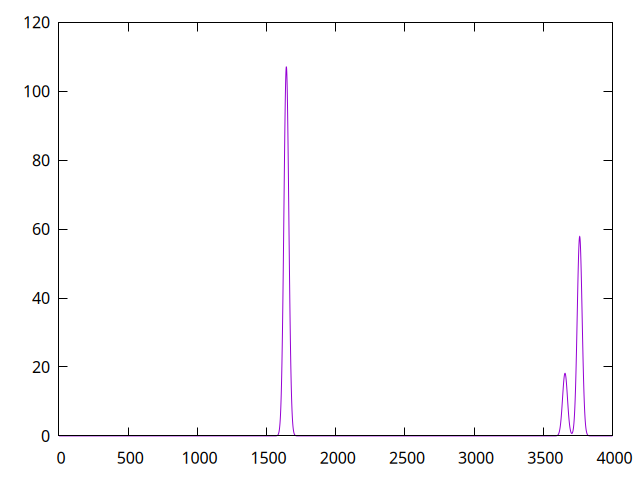

# specsim
simulate IR spectra

## Installation

``` shell
make install
```

### Dependencies
- Working Rust installation with cargo

## Usage
The only required argument is the input file with lines of the form

``` text
FREQ1 INTEN1
...
FREQN INTENN
```

See the `--help`/`-h` flag for other options.

## Example

The first line is the only part strictly related to `specsim`, but you can use
[gnuplot](http://www.gnuplot.vt.edu/) to visualize the results, giving the
output shown below.

``` shell
specsim -d 5 testfiles/h2o.in \
	| gnuplot \
		  -e 'set terminal pngcairo' \
		  -e 'set output "/tmp/example.png"' \
		  -e 'unset key' \
		  -e 'plot "-" with lines'
```


